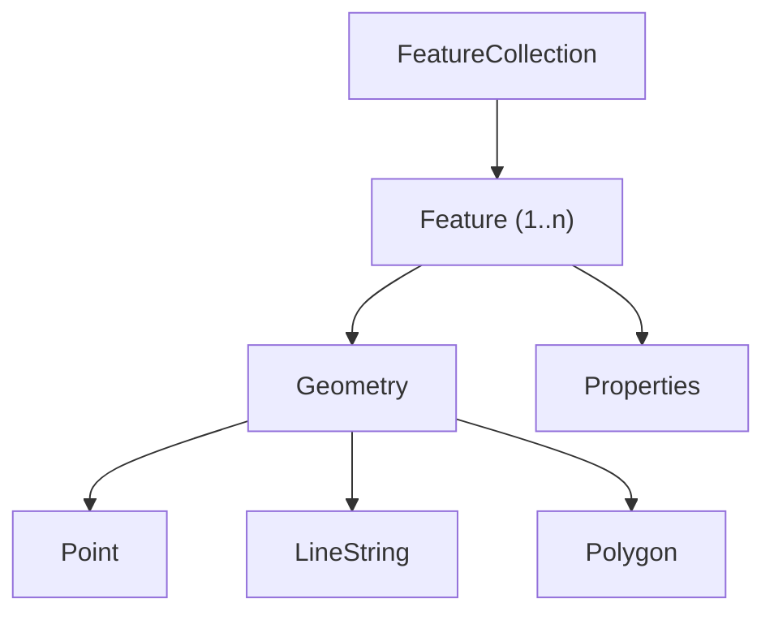

# Understanding GeoJSON: A Developer's Guide to Geospatial Data

When you call NWS API endpoints, many responses come back as GeoJSON—a format that pairs geographic shapes with the data that describes them. After reading this guide, you'll understand why NWS API responses look the way they do and how a single GeoJSON object can hold both a storm polygon and the severity data attached to it.

This isn't a tutorial or reference, but a quick orientation. This page covers:

- What GeoJSON is and why it's useful
- Core data types (Feature, FeatureCollection, Geometry)
- Real-world use cases
- How GeoJSON integrates with the NWS API

## What's GeoJSON?

GeoJSON is an open standard format for representing geographical features as shapes. It's based on JSON, but adds a strict structure that pairs every shape with a `properties` object. The `properties` object is a flexible container storing metadata for each shape. For the NWS API, that metadata is weather data: severity, event type, and affected area.

## The GeoJSON Data Model

To visualize how the GeoJSON model works, we'll look at an example response from the NWS API. Let's say there is a thunderstorm warning in effect for a specified area. The API response for that area returns an object that contains a shape and severity data, bundled together into three main building blocks: `FeatureCollection`, `Feature`, and `Geometry`. Each `FeatureCollection` contains one or more `Features`. Each `Feature` pairs a `Geometry` (the shape) with a `Properties` object (the metadata).

The GeoJSON object structure is hierarchical. This diagram shows how the pieces fit together:



The hierarchy matters for three practical reasons. Because `Features` are nested, weather data like severity lives inside the `Properties` object, not at the top level. To access it, navigate from the top down: `feature.properties.severity`. A single NWS response can also return multiple `Features` at once, so you'll loop over them rather than handle one at a time. Finally, not every `Feature` has the same shape—one alert might be a polygon, another a point, so your code needs to handle both.

In the NWS thunderstorm example, the entire API response is a `FeatureCollection`—the top-level wrapper that holds everything else. Think of it as the envelope: it doesn't contain weather data directly, but it contains the `Features` that do.

```json
{
  "type": "FeatureCollection",
  "features": [
    {
      "type": "Feature",
      "geometry": {
        "type": "Polygon",
        "coordinates": [
          [
            [-74.9, 39.9],
            [-74.6, 39.9],
            [-74.6, 40.1],
            [-74.9, 40.1],
            [-74.9, 39.9]
          ]
        ]
      },
      "properties": {
        "event": "Severe Thunderstorm Warning",
        "severity": "Severe",
        "areaDesc": "Southwestern Burlington County, NJ"
      }
    }
  ]
}
```

Reading from the top down:

- `"type": "FeatureCollection"`: the outer envelope that holds all warnings currently in effect for this request.
- `"features": [...]`: the array inside the envelope. Each item in this array is one warning. Here there's only one, but a single API call can return many.
- `"type": "Feature"`: identifies this item as a single warning—one shape paired with one set of weather data.
- `"geometry"`: the shape of the affected area. In this case, a `Polygon`—a set of coordinates that draws the boundary of the warning zone on a map.
- `"properties"`: the weather data attached to that shape: the event name, severity level, and a plain-language description of the affected area.

## GeoJSON versus Generic JSON

Plain JSON works well for general data exchange—REST APIs, mobile apps, search indexes, and databases use it constantly. But when it comes to mapping and geospatial tools, a shared, predictable schema isn't optional. That's where GeoJSON comes in.

Unlike plain JSON, GeoJSON follows a strict schema defined in [RFC 7946](#). This consistency is what lets different apps parse and display the same location data without ambiguity or guesswork. Without the spec, a coordinate array is just two numbers—nothing stops a tool from reading them in the wrong order. For example, a mapping app that reads GeoJSON is expecting `[longitude, latitude]` in that order. An app that reads regular JSON could reverse the two values, resulting in inaccurate location data.

Consider the difference. Here's a plain JSON object describing a location:

```json
{
  "name": "Central Park",
  "city": "New York",
  "type": "park",
  "coordinates": [40.7851, -73.9683]
}
```

This works fine for a general-purpose API, but a mapping tool has no way to know what these numbers mean or which is which. The `coordinates` value stores two numbers. Without a strict schema that imposes an order, it's not clear which coordinate is latitude and which is longitude.

Here's the same location as valid GeoJSON:

```json
{
  "type": "Feature",
  "geometry": {
    "type": "Point",
    "coordinates": [-73.9683, 40.7851]
  },
  "properties": {
    "name": "Central Park",
    "city": "New York",
    "type": "park"
  }
}
```

Every GeoJSON object must include a `type`, a `geometry`, and a `properties` block. Coordinates follow the RFC 7946 spec: longitude first, then latitude. A GeoJSON-aware tool doesn't need to be told which value is longitude and which is latitude—the spec already answered that. It can read this object immediately.

## Front-End Integration

GeoJSON communicates natively with most modern mapping apps. This makes communication easier for every layer. At the front end, Leaflet, Mapbox GL JS, and OpenLayers can render a shape with a single line:

```javascript
L.geoJSON(myGeoJSON).addTo(map);
```

From there, built-in methods handle styling and interactivity automatically.

## Server-Side and API Exchange

At the API layer, data moves between services without translation. OpenStreetMap and Google Maps can send and receive GeoJSON directly. Your data arrives in a format that every tool already understands.

## Storage and Spatial Querying

PostgreSQL with PostGIS stores GeoJSON objects directly. You can run location-based queries on them without reformatting the data first.

## How GeoJSON Fits into NWS API Workflows

The NWS API returns GeoJSON by default for most endpoints. This means you can go from a live API response to a rendered map without extra lines of code to parse the response.

A typical flow for displaying storm warnings looks like this:

### 1. Fetch active alerts

```bash
curl https://api.weather.gov/alerts/active
```

The response is a GeoJSON `FeatureCollection`. Each feature has alert metadata in `properties` and the affected area in `geometry`.

### 2. Render directly in Leaflet

```javascript
fetch('https://api.weather.gov/alerts/active')
  .then(res => res.json())
  .then(data => L.geoJSON(data).addTo(map));
```

No parsing or reshaping required. Leaflet reads the `FeatureCollection` and draws the polygons.

### 3. Style by severity

```javascript
L.geoJSON(data, {
  style: feature => ({
    color: feature.properties.severity === 'Severe' ? 'red' : 'orange'
  }),
  onEachFeature: (feature, layer) => {
    layer.bindPopup(`${feature.properties.event}<br>${feature.properties.areaDesc}`);
  }
}).addTo(map);
```

Because shape and metadata travel together in a single GeoJSON object, everything you need to render and describe an alert is already bundled there.

## Strengths, Limitations, and Trade-offs

GeoJSON is the right default for most web and API use cases, but there are some scenarios where it is not ideal.

**Strengths:** Lightweight, human-readable, and easy to debug. No special parsers or tooling. Broadly supported across mapping libraries, APIs, and databases.

**Limitations:** GeoJSON has no topology—it doesn't store shared boundaries between adjacent shapes. For that, TopoJSON is a better fit. It's also a text format, so large files can slow parsing. For heavy workloads, binary formats like FlatGeobuf are faster.

| Format | Best For | Watch Out For |
|---|---|---|
| GeoJSON | Web apps, APIs, quick integration | Large files, no topology |
| Shapefile | Legacy GIS workflows | Multi-file, not web-friendly |
| KML | Google Earth, rich styling | Verbose, slower to parse |
| TopoJSON | Shared boundaries, smaller files | Preprocessing required |

**TL;DR:** GeoJSON is easy to read, easy to render, and supported almost everywhere. For most developers building on the web, it's the right starting point—and usually the only format you'll need.

## Summary and Next Steps

GeoJSON is JSON with a shared set of rules for location data. That's what makes it work so well across the modern web stack—it connects your data to your map, your API to your front end, and your app to the broader geospatial ecosystem without any translation layer in between.

Ready to put it into practice:

- **Quickstart Tutorial:** Fetch GeoJSON from the NWS API and render it on a map, step by step.
- **NWS API Reference:** Explore which endpoints return GeoJSON, including active alerts and forecast zones.
