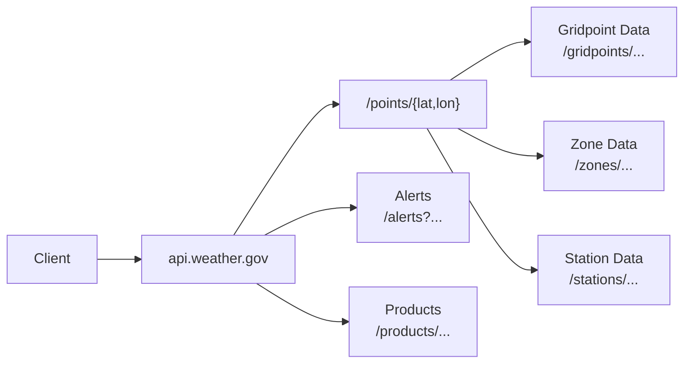

# NWS API Reference

!!! note "What I Did"
    - Reorganized the National Weather Service API documentation around user needs, separating tutorials, how-to guides, reference material, and conceptual explanations
    - Clarified the NWS spatial model (forecast offices, gridpoints, zones, stations) using progressive disclosure and visual diagrams
    - Documented the `/points/{lat,lon}` workflow to explain how location data resolves across multiple systems
    - Wrote developer-focused endpoint reference content with clear parameters, examples, and common error cases
    - Added cross-cutting documentation for shared concepts such as status codes, units, caching, and station metadata
    - Improved navigation and learning flow with clear entry points and “next step” paths throughout the documentation


# Overview

The **National Weather Service (NWS) API** is the official U.S. government source for weather forecasts, observations, and alerts. It provides free, public access to the same real-time data used by meteorologists, emergency managers, and news organizations—covering every location in the United States with highly localized 2.5 km forecast grids.

This is a developer-friendly rewrite of the official API documentation. It focuses on the endpoints developers use most, clarifies the underlying spatial concepts (like forecast offices, gridpoints, and zones), and removes the complexity found in the original government documentation.

**Official source:** [NWS Services Web API Documentation](https://www.weather.gov/documentation/services-web-api)


---

## Quick Start

**Base URL:** `https://api.weather.gov`

- No authentication required
- Returns JSON/GeoJSON
- RESTful design with standard HTTP methods

**Example request:**
```http
GET https://api.weather.gov/points/39.7456,-97.0892
```
Returns forecast URLs, grid coordinates, and station identifiers for that location.

---

## What This API Provides

You can retrieve forecasts, observations, alerts, radar imagery, and specialized data for aviation, marine, and river conditions—all updated continuously to reflect the latest information.

With nationwide coverage and highly localized 2.5 km grids, the NWS API supports both broad regional outlooks and point-level forecasts. Because it connects directly to the same systems used by government agencies and news outlets, you get authoritative, reliable weather data—without subscription fees or commercial restrictions.

---

## What You Can Build

If you're building a weather dashboard, analyzing climate data, or integrating alerts into a public safety application, the NWS API gives you direct access to the same authoritative data used by professionals.

You can:

- Build apps that display local forecasts and active weather alerts
- Integrate live weather data into business dashboards
- Analyze historical observations for research or modeling
- Power emergency management systems with real-time updates

---

## Core Capabilities

- **Current Conditions:** Real-time observations from thousands of U.S. weather stations
- **Forecasts:** Hourly and daily point forecasts for any location
- **Alerts:** Active severe weather warnings, watches, and advisories
- **Historical Data:** Past observations available for analysis
- **Customizable Queries:** Filter by location, time, and weather parameters

---

## How It Works

The NWS API follows REST principles and uses standard HTTP methods such as `GET` to retrieve data. You access data by making requests to specific **endpoints**, each designed for a type of weather information—forecasts, alerts, observations, or zones.

Most responses are returned in **JSON** or **GeoJSON** format. GeoJSON includes geographic coordinates that define points, lines, or polygons, making it ideal for mapping or visualizing weather events.

You don't need an API key or token to start—simply include the base URL in your requests and specify the endpoint and parameters you need.

---

## Typical Request Flow

The NWS API supports multiple weather data types, each retrieved differently. This diagram shows the typical flow from a latitude/longitude input to the correct API endpoints for forecasts, alerts, observations, and zones.

In most cases, you will start with a coordinate and then either request the forecast directly or use `/points` to discover region-specific endpoints such as stations, grid cells, and zones.



### Response Format

All endpoints return JSON with consistent structure:

* `@context`: JSON-LD metadata for semantic web compatibility
* `geometry`: GeoJSON coordinates (when applicable)
* `properties`: Weather data payload

### Additional Content Types

Most developers use JSON. Advanced integrations support:

| Format | MIME Type |
|---------|------------|
| JSON-LD | `application/ld+json` |
| DWML | `application/vnd.noaa.dwml+xml` |
| OXML | `application/vnd.noaa.obs+xml` |
| CAP | `application/cap+xml` |
| ATOM | `application/atom+xml` |

---
## Usage Guidelines

* No authentication required — Start making requests immediately
* Include a User-Agent header — Identify your application (e.g., MyWeatherApp/1.0 (contact@example.com))
* Respect cache headers — Reduce server load and improve performance
* Rate limits — No official limits, but follow best practices to avoid throttling


**Get started in 2 minutes** → [Quick Start Guide](./quick-start.md)
