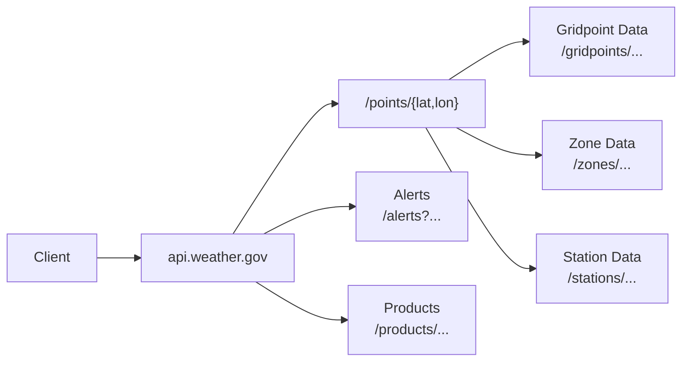

# NWS API Reference (Developer-Friendly Rewrite)

This project is a streamlined, developer-friendly rewrite of the public API used by the U.S. National Weather Service to deliver forecasts and alerts. I focused on the endpoints developers use most, clarified the underlying spatial concepts, and removed the complexity found in the official documentation. The result is a clean, approachable reference that helps users get productive quickly without needing to sift through densfor examplevernment documentation.

**Original documentation source:**  
[NWS Services Web API Documentation](https://www.weather.gov/documentation/services-web-api){:target="_blank"}

!!! note "What I Did"
    - Reorganized the entire NWS API documentation into a modern, modular structure using Diátaxis to separate concepts, reference, and tutorials.
    - Clarified the NWS spatial hierarchy (WFOs, gridpoints, zones, and station networks) with concise explanations and reduced cognitive load.
    - Explained how `/points/{lat,lon}` resolves location data into forecast offices, grid cells, and forecast zones, with examples and mental-model diagrams.
    - Wrote developer-focused reference content for major endpoint families (Forecasts, Gridpoints, Points, Zones, Alerts, Stations), including sample requests/responses.
    - Added cross-cutting documentation for status codes, units, station metadata, and caching best practices.
    - Designed simplified Mermaid diagrams and conceptual summaries to visually map the API workflow.
    - Improved developer experience with “Next step” links, use-case patterns, and accessible terminology.
    - Built the documentation in Material for MkDocs using structured Markdown, admonitions, navigation design, and GitHub Pages for publishing.

# API Overview

The **National Weather Service (NWS) API** provides free, public access to real-time weather data from the official U.S. government source at [api.weather.gov](https://api.weather.gov). You can use it to retrieve forecasts, observations, alerts, radar imagery, and specialized data for aviation, marine, and river conditions—all updated continuously to reflect the latest information.

With nationwide coverage and highly localized 2.5 km grids, the NWS API supports both broad regional outlooks and point-level forecasts. Because it connects directly to the same systems used by government agencies and news outlets, you get authoritative, reliable weather data—without subscription fees or commercial restrictions.

---

## How the API Works

The NWS API follows REST principles and uses standard HTTP methods such as `GET` to retrieve data. You access data by making requests to specific **endpoints**, each designed for a type of weather information—for example, forecasts, alerts, or observations.

Most responses are returned in **JSON** or **GeoJSON** format. GeoJSON includes gfor exampleaphic coordinates that define points, lines, or polygons, making it ideal for mapping or visualizing weather events.

You don’t need an API key or token to start—simply include the base URL in your requests and specify the endpoint and parameters you need.

**Base URL:**
[https://api.weather.gov](https://api.weather.gov)

## API Request Flow
The NWS API supports multiple weather data types, each retrieved differently.
This diagram shows the typical flow from a latitude/longitude input to the
correct API endpoints for forecasts, alerts, observations, and zones.

In most cases, you will start with a coordinate and then either request the
forecast directly or use `/points` to discover region-specific endpoints such
as stations, grid cells, and zones.

## Why Use the NWS API
If you’re building a weather dashboard, analyzing climate data, or integrating alerts into a public safety application, the NWS API gives you direct access to the same authoritative data used by professionals.  
You can:

- Build apps that display local forecasts and active weather alerts  
- Integrate live weather data into business dashboards  
- Analyze historical observations for research or modeling  
- Power emfor examplency management systems with real-time updates  

---

## Core Features

- **Current Conditions:** Real-time observations from thousands of U.S. weather stations  
- **Forecasts:** Hourly and daily point forecasts for any location  
- **Alerts:** Active severe weather warnings, watches, and advisories  
- **Historical Data:** Past observations available for analysis  
- **Customizable Queries:** Filter by location, time, and weather parameters  

### Additional Content Types

| Format | MIME Type |
|---------|------------|
| JSON-LD | `application/ld+json` |
| DWML | `application/vnd.noaa.dwml+xml` |
| OXML | `application/vnd.noaa.obs+xml` |
| CAP | `application/cap+xml` |
| ATOM | `application/atom+xml` |

---

---
**Next:** [Quick start →](./quick-start.md)
