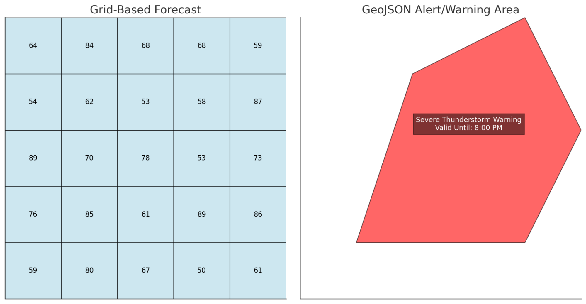

## Alerts and Warnings

The NWS issues **alerts** when there is a need to inform the public about significant weather conditions. They're issued when the weather **may** pose a serious threat, but the impact depends on the severity of the forecast. Alerts include:

- **Watches**
- **Warnings**
- **Advisories**
- **Statements**

**Warnings** are urgent alerts that indicate a serious weather event is imminent or already happening.

---

### Forecast Grids vs. Alert Polygons

The NWS API structures forecasts and alerts differently:

- **Forecasts** use grid points (`gridX`, `gridY`).
- **Alerts** use GeoJSON polygons.

Understanding this distinction is key to proper visualization and response handling.

#### Forecasts (Grid-Based)
- Each location belongs to a **forecast grid** managed by a Weather Forecast Office (WFO).
- Forecast data is returned for specific grid cells (e.g., `gridX: 45, gridY: 30` in Chicago).
- Grid values are **interpolated from multiple observation stations**, not just one.
- This interpolation provides more precise coverage, especially where stations are far apart.

**Example:**  
A Chicago grid cell at (`gridX: 45, gridY: 30`) blends observations from several stations, providing a more reliable forecast than a single station would.

#### Alerts (Polygon-Based)
- Alerts are defined with **irregular GeoJSON polygons**, not grids.
- A grid-based forecast might cover a broad 20 × 20-mile cell, even if the storm won’t impact every point.
- Alerts track the **actual storm path**, ensuring only the affected regions are flagged.
- This precision is critical for emergency management, agriculture, and logistics.

---

## What's GeoJSON?

GeoJSON is an extension of JSON used to encode geographic data structures. It’s the standard format for geographic data in the NWS API.

GeoJSON follows JSON’s syntax but defines special **Geometry Objects** to represent spatial data, including:

- `Point`
- `LineString`
- `Polygon`
- `MultiPoint`
- `MultiLineString`
- `MultiPolygon`

👉 For an in-depth explanation of GeoJSON, see the [GeoJSON Explainer](../../geojson_explainer/index.md)
).
