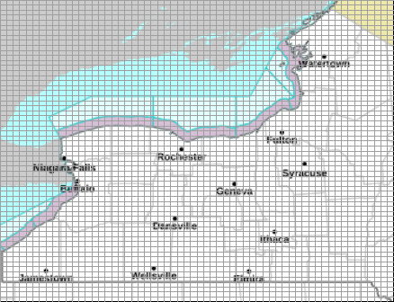

# Gridpoints and Grids

NWS forecasts use a nationwide **2.5 km × 2.5 km** grid system. Each cell represents a small geographic area containing detailed forecast data accessible through the NWS API.

## How Grid Assignment Works

Each grid belongs to a **Weather Forecast Office (WFO)**. When you provide a latitude/longitude to the `/points` endpoint, the API:

1. Determines which WFO owns that location
2. Identifies which grid cell contains the point
3. Returns the grid identifiers needed to request forecasts:
    - `gridId` — WFO identifier (e.g., `BUF`, `OKX`, `LWX`)
    - `gridX` / `gridY` — cell's horizontal and vertical index  within that WFO's grid

Use these values to construct forecast requests: `/gridpoints/{gridId}/{gridX},{gridY}`

## Benefits

Grid-cell level forecasts provide:

- **High spatial resolution** — Fine-grained local forecasts
- **Consistent structure** — Uniform format across all WFOs

## Visual Example

**Figure:** Buffalo NWS office (BUF) showing 2.5 km forecast grid cells with `gridX` and `gridY` coordinates

---

**Next:** Learn how to translate coordinates into [Zones](./zones.md) →
