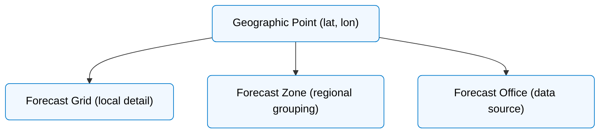

# How These Concepts Fit Together (Hierarchy)

Every forecast starts with a latitude/longitude. The NWS API resolves that point into:

- a grid cell (for detailed forecasts)
- one or more zones (for public forecasts and alerts)
- a forecast office (WFO) responsible for the region

This structure explains why the API returns links instead of direct data when you call `/points/{lat},{lon}`—it’s mapping your location to the correct grid, zones, and office.

**Figure:** Forecast data is organized hierarchically—a point belongs to a grid, which belongs to a zone, all managed by a forecast office (WFO).

👉**Next:** Learn about Weather Forecast Offices [WFOs](./wfos.md) → 