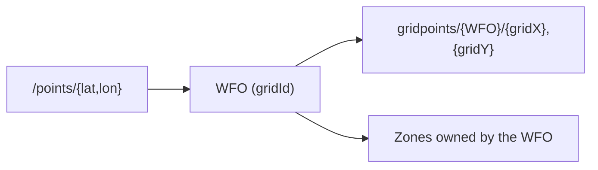

# Weather Forecast Offices (WFOs)

## What is a WFO?
A Weather Forecast Office (WFO) is the local NWS office responsible for generating the forecast and alert data for a specific region. When you call `/points/{lat,lon}`, the API resolves your point to exactly one WFO before determining grid and zone information.

**Example:**  
A user at **38.90, –77.04** (Washington, DC) requests `/points/38.90,-77.04`.

The API returns:

- `"gridId": "LWX"` → Weather Forecast Office: Baltimore/Washington  
- `"gridX": 96`, `"gridY": 70` → Forecast grid cell  
- `"forecastZone": "DCZ001"` → Public forecast zone  
- `"county": "District of Columbia"` → County/zone metadata

This tells your application that all forecast and gridpoint data should be requested from **WFO LWX**.

!!! info "What a WFO represents"
    - A regional operational office responsible for forecasts and local weather products  
    - Defines the spatial domain wherfor exampleidpoint and zone data originate  
    - Appears in API URLs as a short identifier (for example, `LWX`, `OKX`, `SEW`)

    
**Figure:** Weather Forecast Offices for the Northeastern US.

## Where WFOs appear in the API
!!! tip "Common places you'll encounter WFO identifiers"
    - In `/points/{lat,lon}` responses under `gridId`  
    - In `/gridpoints/{office}/{gridX},{gridY}` URLs  
    - In metadata fields for forecast or alert products  

## Why WFOs matter
Each WFO manages its own forecast grids and zones. This means:

- Thfor exampleid and zone definitions for a point depend on the WFO it falls into  
- Two nearby coordinates may belong to different WFOs  
- All `/gridpoints/...` forecast data must be fetched using the correct WFO code  

## Quick visualization

Example WFO identifiers

!!! note ""
- LWX—Baltimore/Washington
- OKX—New York City
- SEW—Seattle
- MFL—Miami
- BOU—Boulder

## Developer takeaway

Always use the WFO returned by /points/{lat,lon} when requesting forecasts, gridpoint data, or zone-based alerts.

👉**Next:** Learn about [Gridpoints and Grids](./grids.md) → 