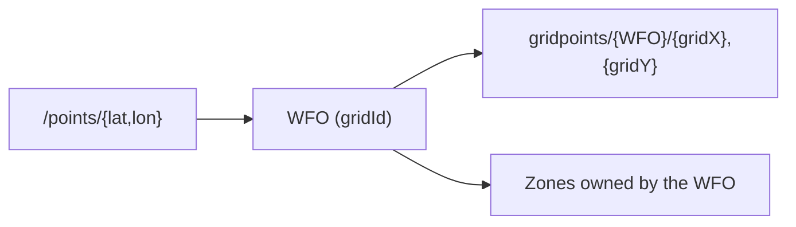

# Weather Forecast Offices (WFOs)

A Weather Forecast Office (WFO) is your regional NWS office that generates forecasts and alerts. When you call `/points/{lat,lon}`, the API assigns your coordinates to exactly one WFO, which determines all subsequent grid and zone data.

## Example: Washington, DC
Requesting `/points/38.90,-77.04` returns:

- `gridId: "LWX"` → Baltimore/Washington WFO
- `gridX: 96, gridY: 70` → Your forecast grid cell
- `forecastZone: "DCZ001"` → Public forecast zone

All forecast data for this location must use WFO `LWX`.

## Where you'll see WFO identifiers
- `/points/{lat,lon}` responses (`gridId` field)
- `/gridpoints/{wfo}/{gridX},{gridY}` URLs
- Forecast and alert metadata

## Why this matters
**Each WFO manages its own forecast grids.** Two nearby coordinates may belong to different WFOs, so always use the WFO returned by `/points` when requesting gridpoint data.
  
  

**Figure:** WFO boundaries in the Northeastern US. Notice how coverage areas meet at defined borders—coordinates near these boundaries may resolve to different WFOs.

## Quick visualization

**Example WFO identifiers:**

- LWX—Baltimore/Washington
- OKX—New York City
- SEW—Seattle
- MFL—Miami
- BOU—Boulder

## Developer takeaway

Always use the WFO returned by `/points/{lat,lon}` when requesting forecasts, gridpoint data, or zone-based alerts.

**Next:** Learn about [Gridpoints and Grids](./grids.md) → 