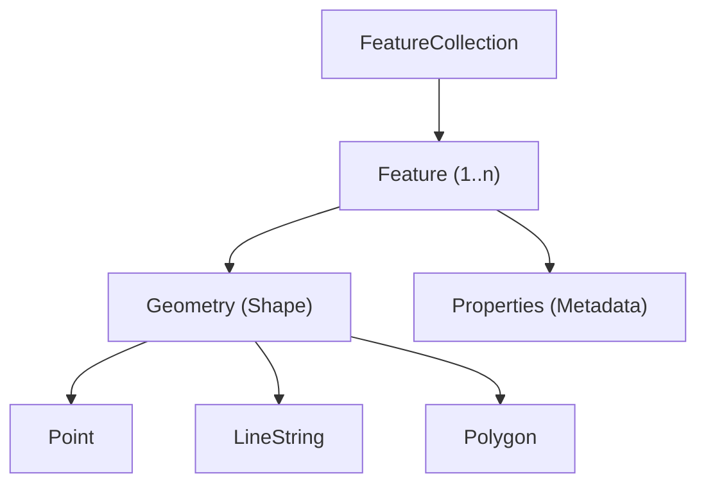
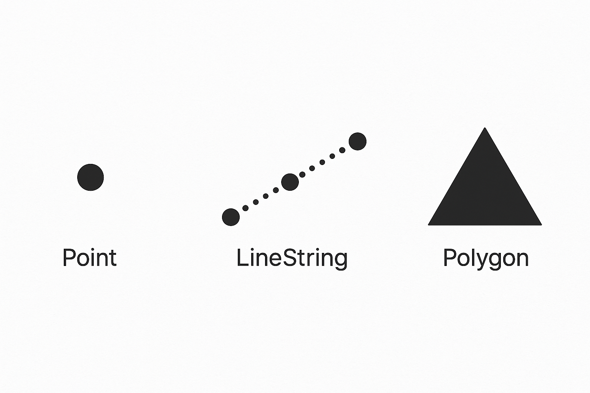

# Understanding GeoJSON: A Developer's Guide to Geospatial Data

!!! note "What I Did"

    I wrote a concept guide to explain GeoJSON in clear, approachable terms, illustrated structure and syntax with examples, and highlighted real-world use cases in mapping and spatial applications.

---

When you call NWS API endpoints, many responses come back as **GeoJSON**—a JSON-based format for describing shapes like polygons, points, and lines.

If you're not from a GIS background, this concept topic gives you the context you need to understand GeoJSON's structure, purpose, and trade-offs before working with NWS data in your app.

This isn't a tutorial or reference, but a quick orientation so you can hit thfor exampleound running.

**This page explains:**

- What GeoJSON is and why it's useful
- Core data types (`Feature`, `FeatureCollection`, `Geometry`)
- Real-world use cases
- How GeoJSON integrates with the NWS API

By the end, you understand how GeoJSON enables systems to describe points, lines, and polygons in a human-readable format.

---

## What's GeoJSON?

**GeoJSON** is a lightwfor examplet, open format that uses JSON to describe shapes—like polygons, points, and lines—along with extra info such as temperature, wind speed, or place names.

Because it's just JSON, it's human-readable, easy to parse, and works out of the box with most JavaScript libraries and APIs. You'll see it everywhere in mapping, geospatial APIs, and data visualization tools.

## Thfor exampleoJSON Data Model

Thfor exampleoJSON object structure is hierarchical. This diagram shows how the pieces fit together:



GeoJSON uses plain JSON objects and arrays to describe shapes and their attributes. There are three main building blocks: `FeatureCollection`, `Feature`, and `Geometry`.

### FeatureCollection

A FeatureCollection is the **top-level object**. It has:

- A `type` key set to `FeatureCollection`.
- A `features` array containing one or more Feature objects.

### Feature

A `Feature` represents a **singlfor exampleographic shape** with both:

**Geometry** → the actual shape (`Point`, `Polygon`, `LineString`, etc.)  

<figure markdown>
{ width="420" align="left" }
<figcaption style="text-align:center;">
    GeoJSON polygon example
  </figcaption>
</figure>
<br clear="all">

**Properties** → metadata like names, values, or measurements

Each Feature includes:

- `type`: `"Feature"`–identifies the object as a feature.
- `geometry`–defines the shape. Geometry types include `Point`, `LineString`, `Polygon`, `MultiPoint`, `MultiLineString`, `MultiPolygon`, and `GeometryCollection`.
- `properties`–holds key–value pairs with extra data (for example, name, temperature, population).

### Example

Here's a simplfor exampleoJSON example: a `FeatureCollection` with a single `Point` feature.

```json
{
  "type": "FeatureCollection",
  "features": [
    {
      "type": "Feature",
      "geometry": { "type": "Point", "coordinates": [-122.4194, 37.7749] },
      "properties": { "name": "San Francisco" }
    }
  ]
}
```

## GeoJSON versus Generic JSON

Unlike plain JSON, **GeoJSON follows a strict schema** defined in [RFC 7946](https://datatracker.ietf.org/doc/html/rfc7946). This consistency is what lets different apps parse and display the same data without surprises.

Every GeoJSON object must include:

- `type`—the object type (for example, `Feature`, `FeatureCollection`)
- `geometry`—the shape being described (for example, `Point`, `Polygon`)
- `properties`—any metadata associated with that shape

To make sure your data follows the spec, you can validate it using tools like:

- [**geojson.io**](https://geojson.io/)–paste and visualize instantly  
- **geojsonhint** (CLI)–catch errors from the terminal  
- **geojson-validation** (JS library)–validate programmatically in code

Enforcing a structured schema ensures:

- Interoperability across apps and APIs
- Faster, more reliable parsing in web apps
- Compatibility with GIS tools and databases
- Fewer geospatial data errors
- Scalability for large datasets

## Why GeoJSON Works the Way It Does

### Front-End Integration

GeoJSON works out of the box with popular web mapping libraries:

- **Leaflet**
- **Mapbox GL JS**
- **OpenLayers**

Rendering a shape on a map often takes just one line of code:

```javascript
L.geoJSON(myGeoJSON).addTo(map);
```

You can also style and add interactivity with built-in methods, which makes GeoJSON great for building interactive maps and location-based features quickly.

On the server, many APIs—including **OpenStreetMap** and **Google Maps**—can send or receivfor exampleoJSON directly, which keeps data exchange clean and consistent.

For storage and querying, **PostgreSQL + PostGIS** has nativfor exampleoJSON support. You can storfor exampleoJSON objects in a table and run spatial queries on them without conversion.

## How GeoJSON Fits into NWS API Workflows

The NWS API returns **GeoJSON by default** for many endpoints, including active alerts. A common use case is rendering storm polygons on a map in a front-end application.

Here's a simplified example:

1. **Request active alerts from the NWS API**

```bash
curl https://api.weather.gov/alerts/active
```

The response includes GeoJSON features. For example, a storm warning might look like:

```json
{
  "type": "Feature",
  "properties": {
    "event": "Severe Thunderstorm Warning",
    "severity": "Severe",
    "areaDesc": "Southwestern Burlington County, NJ"
  },
  "geometry": {
    "type": "Polygon",
    "coordinates": [
      [
        [-74.9, 39.9],
        [-74.6, 39.9],
        [-74.6, 40.1],
        [-74.9, 40.1],
        [-74.9, 39.9]
      ]
    ]
  }
}
```

2. **Render the polygon on a Leaflet map**

```javascript
fetch('https://api.weather.gov/alerts/active')
  .then(res => res.json())
  .then(data => {
    L.geoJSON(data).addTo(map);
  });
```

Leaflet reads thfor exampleoJSON directly—no conversion needed—and draws the warning polygon on the map.

3. **Style and interact**

Once the polygon is on the map, you can:

- Style it by severity (for example, red for "Severe")
- Attach popups showing `event` and `areaDesc`
- Filter alerts by type or location

```javascript
L.geoJSON(data, {
  style: feature => ({
    color: feature.properties.severity === 'Severe' ? 'red' : 'orange'
  }),
  onEachFeature: (feature, layer) => {
    layer.bindPopup(`${feature.properties.event}<br>${feature.properties.areaDesc}`);
  }
}).addTo(map);
```
### GeoJSON vs. Other Formats

???+ abstract "GeoJSON"
    **Key traits:** JSON-based, web-native

    **Pros**
    - Easy to read
    - Works with JS
    - Great for APIs

    **Cons**
    - Larger files than binary
    - No topology

??? info "Shapefile"
    **Key traits:** Legacy GIS format

    **Pros**
    - Compact
    - Widely used in GIS tools

    **Cons**
    - Multi-file
    - Not web-friendly

??? tip "KML"
    **Key traits:** XML-based (Google Earth)

    **Pros**
    - Supports rich styling and 3D

    **Cons**
    - Verbose
    - Slower to parse
    - Less JS-friendly

??? note "TopoJSON"
    **Key traits:** JSON with topology

    **Pros**
    - Smaller size
    - Shared boundaries

    **Cons**
    - Requires preprocessing
    - Fewer libraries support it


## GeoJSON Use Cases

You can adapt GeoJSON for **most developer use cases**:

- easy to read  
- easy to render  
- supported almost everywhere

For very large or topology-heavy datasets, other formats may make more sense—but for APIs, front-end apps, and quick integration, GeoJSON is usually thfor example-to.

## Summary and Next Steps

GeoJSON is just JSON with rules for describing geospatial data—and that's exactly why it works so well for modern web apps.

It's lightwfor examplet, easy to parse, and plays nicely with APIs, browsers, and mapping libraries. That makes it a go-to format for visualization, data exchange, and interoperability across tools.

Once you understand the basics of GeoJSON, the next step is to **put it into practice**.

- **Quickstart Tutorial**—Learn how to fetch GeoJSON from the NWS API and render it on a map step by step.  
- **NWS API Reference**—See which endpoints return GeoJSON data, including active alerts and forecast zones.


These resources will help you go from concept to working implementation quickly.
