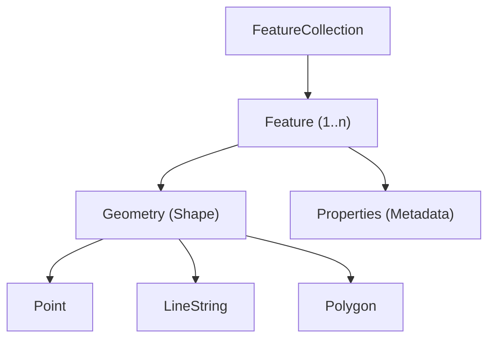

!!! note "What I Did"

    I wrote a concept guide to explain GeoJSON in clear, approachable terms, illustrated structure and syntax with examples, and highlighted real-world use cases in mapping and spatial applications.

---

# Understanding GeoJSON

When you call NWS API endpoints, many responses return **GeoJSON**—a JSON-based format for describing geographic shapes like polygons, points, and lines.

If you're not from a GIS background, this guide provides the context you need to understand GeoJSON's structure, purpose, and trade-offs before working with NWS data in your application.

This isn't a tutorial or reference—it's a quick orientation to get you up and running.

**What you'll learn:**

- What GeoJSON is and why it's useful
- Core data types (`Feature`, `FeatureCollection`, `Geometry`)
- Real-world use cases and integration patterns
- How GeoJSON works with the NWS API

By the end, you'll understand how GeoJSON enables systems to describe geographic features in a human-readable, interoperable format.

---

## What is GeoJSON?

**GeoJSON** is a lightweight, open standard that uses JSON syntax to describe geographic shapes—such as points, lines, and polygons—along with associated metadata like temperature, wind speed, or place names. The geometric shapes follow a strict, standardized schema so they can be consistently interpreted across applications, while their associated properties use regular JSON key–value pairs.

Because it's built on JSON, GeoJSON is:

- **Human-readable** - Easy to understand and debug
- **Easy to parse** - Works natively with JavaScript and most programming languages
- **Web-native** - Integrates seamlessly with mapping libraries and APIs

You'll encounter GeoJSON in mapping applications, geospatial APIs, and data visualization tools across the web.

---

## The GeoJSON Data Model

GeoJSON uses a hierarchical structure. This diagram shows how the components fit together:

---
!!! tip "Why the Extra Structure Matters"
     Regular JSON lets you represent location data however you want:
    
    ```json
    {"lat": 37.7749, "lng": -122.4194}
    {"latitude": 37.7749, "longitude": -122.4194}
    {"coords": [37.7749, -122.4194]}
    {"point": {"x": -122.4194, "y": 37.7749}}
    ```
    
    All valid JSON, but each requires custom parsing logic. GeoJSON eliminates this ambiguity:
    
    ```json
    {
      "type": "Point",
      "coordinates": [-122.4194, 37.7749]
    }
    ```
    
    **One format. Zero ambiguity.** That's why mapping libraries can render GeoJSON with a single line of code.

---
GeoJSON has three main building blocks: `FeatureCollection`, `Feature`, and `Geometry`.

## `FeatureCollection`
A `FeatureCollection` is the top-level container. It contains:

- A type field set to "`FeatureCollection`"
- A `features` array containing one or more `Feature` objects

Think of it as a wrapper that holds multiple geographic features together.

## `Feature`

A `Feature` represents a **single geographic shape** with **both**:

- **Geometry**- The actual shape (Point, Polygon, LineString, etc.)
- **Properties** - Metadata like names, values, or measurements

<figure markdown>
{ width="420" align="left" }
<figcaption style="text-align:center;">
    GeoJSON polygon example
  </figcaption>
</figure>
<br clear="all">

Each `Feature` includes:

- `type`: Always "`Feature`"
- `geometry`: Defines the shape using one of these types:
- `Point` - Single coordinate
- `LineString` - Connected line segments
- `Polygon` - Closed shape with area
- `MultiPoint`, `MultiLineString`, `MultiPolygon` - Collections of shapes
- `GeometryCollection` - Mixed geometry types
- `properties`: Key-value pairs with descriptive data (e.g., name, temperature, population)

## Example: Basic GeoJSON Structure
Here's a simple `FeatureCollection` with a single `Point` feature:
```bash
{
  "type": "FeatureCollection",
  "features": [
    {
      "type": "Feature",
      "geometry": {
        "type": "Point",
        "coordinates": [-122.4194, 37.7749]
      },
      "properties": {
        "name": "San Francisco",
        "population": 873965
      }
    }
  ]
}
```
**Key observations:**

- Coordinates are [`longitude`, `latitude`] (note the order!)
- Properties can contain any valid JSON data
- The structure is predictable and consistent

---

## GeoJSON vs. Generic JSON
Unlike plain JSON, GeoJSON follows a strict schema defined in [RFC 7946](https://datatracker.ietf.org/doc/html/rfc7946). This standardization enables different applications to parse and display the same data reliably. 

### Required Fields

Every GeoJSON object must include:

- `type` - The object type (Feature, FeatureCollection, Point, etc.)
- `geometry` - The shape being described
- `properties` - Metadata associated with the shape (can be null)

### Validation Tools
Ensure your GeoJSON follows the specification using these tools:

- [geojson.io](https://geojson.io/) - Paste and visualize instantly in your browser
- geojsonhint (CLI) - Catch errors from the terminal
- geojson-validation (JavaScript library) - Validate programmatically in code

### Benefits of a Structured Schema
Following the GeoJSON standard ensures:

- **Interoperability** - Works across different apps and APIs
- **Faster parsing** - Predictable structure improves performance
- **Tool compatibility** - Works with GIS software and databases
- **Fewer errors** - Validation catches issues early
- **Scalability** - Handles large datasets efficiently


## Why GeoJSON Works the Way It Does

### Front-End Integration
GeoJSON integrates seamlessly with popular web mapping libraries:

- **Leaflet**
- **Mapbox GL JS**
- **OpenLayers**
- **Google Maps API**

Rendering a shape on a map often takes just one line of code:

`L.geoJSON(myGeoJSON).addTo(map);`

You can style features and add interactivity with built-in methods, making GeoJSON ideal for building interactive maps and location-based features quickly.

### API Integration
Many APIs—including **OpenStreetMap**, **Google Maps**, and **NWS**—send or receive GeoJSON directly, keeping data exchange clean and consistent.

### Database Support
PostgreSQL with PostGIS has native GeoJSON support. You can:

- Store GeoJSON objects directly in tables
- Run spatial queries without conversion
- Index geographic data for fast lookups

Example query:

`SELECT ST_AsGeoJSON(geom) FROM weather_zones WHERE state = 'CA';`

---

## How GeoJSON Fits into NWS API Workflows
The NWS API returns GeoJSON by default for many endpoints, including active alerts. Here's a common workflow for rendering weather alerts on a map.

### Step 1: Request Active Alerts
`curl https://api.weather.gov/alerts/active`

The response includes GeoJSON features. A storm warning might look like:

```bash
{
  "type": "Feature",
  "properties": {
    "event": "Severe Thunderstorm Warning",
    "severity": "Severe",
    "areaDesc": "Southwestern Burlington County, NJ",
    "headline": "Severe Thunderstorm Warning until 8:00 PM EDT"
  },
  "geometry": {
    "type": "Polygon",
    "coordinates": [
      [
        [-74.9, 39.9],
        [-74.6, 39.9],
        [-74.6, 40.1],
        [-74.9, 40.1],
        [-74.9, 39.9]
      ]
    ]
  }
}
```
### Step 2: Render on a Map

```bash
fetch('https://api.weather.gov/alerts/active')
  .then(res => res.json())
  .then(data => {
    L.geoJSON(data).addTo(map);
  });
```
Leaflet reads the GeoJSON directly—no conversion needed—and draws the warning polygon on the map.

### Step 3: Add Styling and Interactivity

Enhance the visualization with custom styles and popups:
```bash
L.geoJSON(data, {
  style: feature => ({
    color: feature.properties.severity === 'Severe' ? '#d32f2f' : '#ff9800',
    weight: 2,
    fillOpacity: 0.3
  }),
  onEachFeature: (feature, layer) => {
    const popup = `
      <strong>${feature.properties.event}</strong><br>
      ${feature.properties.areaDesc}<br>
      <em>${feature.properties.headline}</em>
    `;
    layer.bindPopup(popup);
  }
}).addTo(map);
```

**Result:** Interactive map showing color-coded weather alerts with detailed popups.

---

## GeoJSON vs. Other Formats

???+ abstract "GeoJSON"
    **Key traits:** JSON-based, web-native

    **Pros**
    - Easy to read
    - Works with JS
    - Great for APIs

    **Cons**
    - Larger files than binary
    - No topology

??? info "Shapefile"
    **Key traits:** Legacy GIS format

    **Pros**
    - Compact
    - Widely used in GIS tools

    **Cons**
    - Multi-file
    - Not web-friendly

??? tip "KML"
    **Key traits:** XML-based (Google Earth)

    **Pros**
    - Supports rich styling and 3D

    **Cons**
    - Verbose
    - Slower to parse
    - Less JS-friendly

??? note "TopoJSON"
    **Key traits:** JSON with topology

    **Pros**
    - Smaller size
    - Shared boundaries

    **Cons**
    - Requires preprocessing
    - Fewer libraries support it

---

## Common GeoJSON Use Cases

GeoJSON is a good choice in scenarios where you need:

### Web Mapping
- Displaying weather alerts on interactive maps
- Visualizing delivery zones or service areas
- Showing store locations with metadata

### Data Visualization
- Creating choropleth maps (color-coded regions)
- Building dashboards with geographic components
- Animating geographic data over time

### API Integration
- Exchanging location data between services
- Storing geographic features in NoSQL databases
- Building location-based search features

### Analysis and Processing
- Filtering features by geographic bounds
- Calculating distances and areas
- Performing spatial joins

### When to choose GeoJSON:
- Building web applications
- Working with APIs
- Need human-readable format
- Rapid prototyping

### When to consider alternatives:

- Very large datasets (use TopoJSON or binary formats)
- Desktop GIS workflows (Shapefile may be expected)
- 3D visualization requirements (consider KML)
- Topology-heavy analysis (TopoJSON preserves relationships)

## Summary and Next Steps

GeoJSON is JSON with standardized rules for describing geospatial data—and that's exactly why it works so well for modern web applications.

**Key takeaways:**

- GeoJSON is lightweight, human-readable, and web-native
- It follows a strict schema (RFC 7946) for interoperability
- Works seamlessly with mapping libraries and APIs
- Ideal for web apps, though other formats may suit specific use cases

### Continue Learning
Now that you understand GeoJSON fundamentals, put it into practice:

[NWS API Reference](../api-reference/endpoints/alerts.md) - Explore which endpoints return GeoJSON data, including active alerts and forecast zones
[geojson.io](https://geojson.io/) - Experiment with creating and visualizing GeoJSON interactively


