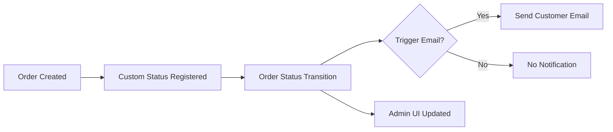
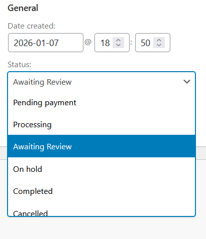

!!! note "What I Did"

    I wrote a technical tutorial that produces a WooCommerce plugin implementing a custom order status with admin workflows and customer email notifications. The guide is intended for intermediate WooCommerce users and plugin developers.
---

# Build a custom WooCommerce order status with customer email notifications

## Background

The default installation of WooCommerce does not include the option to
add a custom order status. Some stores need to place certain orders into
a **manual review** state before fulfillment (for example, fraud checks
or stock confirmation). In this tutorial, you'll implement an
**"Awaiting Review"** status and a customer email that communicates what
it means and what happens next.

This tutorial follows a live-site ready approach:

- Status registration
- Admin workflows
- Customer email notifications
- Testing

Some common reasons to add a custom "Awaiting Review" order status
include:

- **Fraud or payment verification:** hold flagged or high-value orders
  for manual review before fulfillment.
- **Inventory confirmation:** pause fulfillment until stock or supplier
  availability is confirmed.
- **Support investigation:** give staff a safe holding state while
  resolving issues, with a clear customer message.

This tutorial walks through the core steps required to add a new order status and integrate it into the WooCommerce order lifecycle. You can easily adapt these steps to fit your specific use case.

## **Overview**

The diagram below shows the high-level lifecycle of a custom WooCommerce order status, from registration to customer notification.



### **Learning objectives**

By the end of this tutorial, you will be able to:

- Add a **custom order status** to WooCommerce.
- Add **admin workflows** to apply the status (bulk + single-order
  action).
- Create and register a **custom WC_Email** notification.
- Trigger the email **manually** (admin action) and **automatically**
  (on status change).
- Verify the feature with a **QA checklist**.

### **Intended audience and background knowledge**

This tutorial is for developers who can:

- Create a basic WordPress plugin
- Read PHP and WordPress hooks/filters
- Navigate WooCommerce admin screens

### **Prerequisite background knowledge**

You should be familiar with:

- WordPress plugin structure (wp-content/plugins)
- WooCommerce orders and order statuses
- Basic debugging (logs/order notes)

## **Before you begin** 

### **Prerequisites**

- A local WordPress site with WooCommerce installed
- Your site is using the **new WooCommerce Orders experience (HPOS /
  wc-orders)** (as in your build)
- A code editor
- Optional (recommended): an email logging plugin to view outbound
  emails locally

### **Project structure (recommended)** 

You'll create a plugin with this structure:

```
wc-custom-order-status/
├── wc-custom-order-status.php        # Main plugin file
├── includes/
│   ├── admin-bulk-actions.php
│   ├── admin-order-actions.php
│   ├── status-email-triggers.php
│   └── emails/
│       └── class-wc-email-awaiting-review.php
└── templates/
    └── emails/
        ├── custom-status-email.php
        └── plain/
            └── custom-status-email.php
```

## **Steps** 

## **Step 1: Create the plugin scaffold**

In this step, you'll create the minimum file and folder structure
required for WordPress to recognize and activate your plugin.

### **1. Create the plugin directory**

Create a new folder:
  
`wp-content/plugins/wc-custom-order-status/`

### **2. Create the main plugin file**

Inside that folder, create:

`wc-custom-order-status.php`

You'll add the plugin header and an ABSPATH guard in the next step.

### **3. Create supporting folders**

Create these folders (we'll use them later for implementation and email
templates):

`includes/`

`templates/`

Optional (WooCommerce-friendly expansion):

If you prefer to organize email code and templates from the start, you
can also add:

`includes/emails/`

`templates/emails/`

### **Result**

**WordPress can detect and activate the plugin**, and you have a clean
structure to build on.

**Next:** Register the **Awaiting Review** order status so it appears in
the WooCommerce admin order workflow.

## **Step 2: Register the Awaiting Review order status**

In this step, you'll register a new WooCommerce order status and make it
selectable in the admin order screen.

### **2.1 Register the custom order status**

Use `register_post_status()` to register a new status called
`wc-awaiting-review`.
WooCommerce order statuses are registered as WordPress post statuses and
must be prefixed with `wc-`.

```php
add_action( 'init', 'wc_register_awaiting_review_status' );

function wc_register_awaiting_review_status() {
    register_post_status(
        'wc-awaiting-review',
        array(
            'label'                     => 'Awaiting Review',
            'public'                    => true,
            'exclude_from_search'       => false,
            'show_in_admin_all_list'    => true,
            'show_in_admin_status_list' => true,
        )
    );
}
```

This makes the status known to WordPress and visible in the admin
interface.

### **2.2 Add the status to WooCommerce's status list**

Registering the post status alone is not enough. You must also add it to
WooCommerce's internal list of order statuses so it appears in dropdowns
and filters.

```php
add_filter(
    'wc_order_statuses',
    'wc_add_awaiting_review_to_order_statuses'
);

function wc_add_awaiting_review_to_order_statuses( $order_statuses ) {
    $new_statuses = array();

    foreach ( $order_statuses as $key => $label ) {
        $new_statuses[ $key ] = $label;

        if ( 'wc-processing' === $key ) {
            $new_statuses['wc-awaiting-review'] = 'Awaiting Review';
        }
    }

    return $new_statuses;
}
```

This example inserts **Awaiting Review** immediately after
**Processing**, which keeps the workflow intuitive for store staff.

You can adjust the insertion point to match your store's fulfillment
process.

### **2.3 Verify the status appears in the admin**

At this point, the status should be selectable in WooCommerce.

**Test it now:**

1.  Go to **WooCommerce → Orders**

2.  Open any order

3.  Open the **Status** dropdown

4.  Confirm **Awaiting Review** appears in the list



**Figure 2.3** - *Order status dropdown showing the custom* **Awaiting Review** *status*

### **Result**

The **Awaiting Review** status is now registered and available in the
WooCommerce admin panel.

In the next step, you'll connect this status to a **customer email
notification** so customers understand what happens next.

## **Step 3: Add bulk actions in the Orders list (HPOS / wc-orders)**

In this step, you'll add a bulk action that lets staff move multiple
orders to **Awaiting Review** at once. This implementation targets the
**HPOS (High-Performance Order Storage)** Orders screen (WooCommerce →
Orders, URL: `admin.php?page=wc-orders`).

### **3.1 Create includes/admin-bulk-actions.php**

Create the file:

`wp-content/plugins/wc-custom-order-status/includes/admin-bulk-actions.php`

Add the following code:

```php

<?php
/**
 * Admin: Bulk actions for WooCommerce Orders screen (HPOS / wc-orders).
 *
 * @package wc-custom-order-status
 */

if ( ! defined( 'ABSPATH' ) ) {
	exit;
}

/**
 * Add "Change status to Awaiting Review" to bulk actions on the new Orders screen.
 * Screen URL: /wp-admin/admin.php?page=wc-orders
 */
add_filter( 'bulk_actions-woocommerce_page_wc-orders', function( $bulk_actions ) {
	$bulk_actions['mark_awaiting-review'] = __( 'Change status to Awaiting Review', 'wc-custom-order-status' );
	return $bulk_actions;
} );

/**
 * Handle the bulk action: set selected orders to awaiting-review.
 *
 * Note: update_status() expects the status slug WITHOUT the 'wc-' prefix.
 */
add_filter( 'handle_bulk_actions-woocommerce_page_wc-orders', function( $redirect_url, $action, $order_ids ) {

	if ( 'mark_awaiting-review' !== $action ) {
		return $redirect_url;
	}

	$changed = 0;

	foreach ( (array) $order_ids as $order_id ) {
		$order = wc_get_order( $order_id );

		if ( ! $order ) {
			continue;
		}

		$order->update_status(
			'awaiting-review',
			__( 'Bulk action: Awaiting Review', 'wc-custom-order-status' )
		);

		$changed++;
	}

	return add_query_arg(
		array( 'bulk_awaiting_review' => $changed ),
		$redirect_url
	);

}, 10, 3 );

/**
 * Admin notice after applying bulk action.
 */
add_action( 'admin_notices', function() {

	if ( empty( $_GET['bulk_awaiting_review'] ) ) {
		return;
	}

	$count = (int) $_GET['bulk_awaiting_review'];

	printf(
		'<div class="notice notice-success is-dismissible"><p>%s</p></div>',
		esc_html(
			sprintf(
				_n(
					'%d order set to Awaiting Review.',
					'%d orders set to Awaiting Review.',
					$count,
					'wc-custom-order-status'
				),
				$count
			)
		)
	);
} );
```

What this file does:

- **Adds a bulk action** named **Change status to Awaiting Review** to
  the Orders list UI.

- **Handles the action** by looping through selected orders and calling
  update_status( \'awaiting-review\' ).

- **Adds an admin notice** showing how many orders were updated.

### **3.2 Load the bulk-actions file from your main plugin file**

In your main plugin file (`wc-custom-order-status.php`), include the file
so it runs in wp-admin:

`require_once __DIR__ . '/includes/admin-bulk-actions.php';`

### **3.3 Test it now**

1.  Go to **WooCommerce → Orders**

2.  Select multiple orders using the checkboxes

3.  Open **Bulk actions**

4.  Choose **Change status to Awaiting Review**

5.  Click **Apply**

6.  Confirm:

    - the selected orders update to **Awaiting Review**

    - you see a success notice (for example: "3 orders set to Awaiting
      Review.")

### **Result**

Store staff can now set **Awaiting Review** on multiple orders in a
single action--useful for fraud review queues, inventory holds, or
support investigations.


**Figure 3.3** - *Drop-down in Bulk Actions showing Change status to Awaiting Review in the WooCommerce Orders Panel.*

## **Step 4: Add a single-order admin action (Order actions dropdown)**

In this step, you'll add an admin-only action to the **Order actions**
dropdown on the order edit screen. Staff can use it to manually send the
**Awaiting Review** email for a single order (useful for edge cases and
support workflows).

### **4.1 Add an Order action to the dropdown**

Create a new file (or reuse your admin module pattern):

`includes/admin-**order**-actions.php`

Add an action to the **Order actions** dropdown using the
`woocommerce_order_actions filter`.

```
  <?php
/**
 * Admin: Single-order action for the WooCommerce Order actions dropdown.
 *
 * @package wc-custom-order-status
 */

if ( ! defined( 'ABSPATH' ) ) {
	exit;
}

add_filter( 'woocommerce_order_actions', function( $actions ) {

	// Action keys should be unique and slug-like.
	$actions['wc_cos_send_awaiting_review_email'] = __(
		'Send Awaiting Review Email',
		'wc-custom-order-status'
	);

	return $actions;
} );
```

### **4.2 Handle the action when an admin runs it**

WooCommerce fires a dynamic hook when the action is executed:

`woocommerce_order_action\_{your_action_key}`

Add the handler hook using the same action key you registered above:

```php

add_action(
	'woocommerce_order_action_wc_cos_send_awaiting_review_email',
	function ( $order ) {

		if ( ! $order || ! is_a( $order, 'WC_Order' ) ) {
			return;
		}

		// Add an order note for auditability (admins can see when/why it was sent).
		$order->add_order_note(
			__( 'Admin action: Sent Awaiting Review email.', 'wc-custom-order-status' )
		);

		/**
		 * Trigger your custom email.
		 *
		 * Replace this placeholder with the actual trigger you implement in the email step.
		 * Common patterns:
		 * - Call your custom email class directly (recommended)
		 * - Use WC()->mailer() to access registered email instances
		 */
		do_action( 'wc_cos_trigger_awaiting_review_email', $order->get_id(), $order );
	}
);
```

Why the `do_action()` placeholder?

- It lets you ship Step 4 without coupling it tightly to your email
  class structure.

- In the next step (emails), you'll hook your email implementation to
  wc_cos_trigger_awaiting_review_email.

If you already have your email class, you can replace the placeholder
with your direct call later -- no need to change Step 4's UI wiring.

### **4.3 Load the module from your main plugin file**

In wc-custom-order-status.php, include the file:

 ```php
 require_once __DIR__ . '/includes/admin-order-actions.php';
 ```

### **4.4 Test it now**

1.  Go to **WooCommerce → Orders**

2.  Open an order

3.  Find the **Order actions** dropdown (usually in the **Order
    actions** box on the right)

4.  Select **Send Awaiting Review Email**

5.  Click the **arrow button** next to the dropdown (not the main
    **Update** button)

6.  Confirm an **order note** appears (for example: "Admin action: Sent
    Awaiting Review email.")

### **Result**


**Figure 4.4** - *Add an action to the* **Order Actions** *dropdown*

Admins can manually trigger the Awaiting Review email for a single
order, with a logged order note for traceability.

**Next:** Implement the custom email itself and hook it to
`wc_cos_trigger_awaiting_review_email` so this action actually sends the
message.

## **Step 5: Create and register the custom WooCommerce email class**

In this step, you'll create a custom WooCommerce email (WC_Email) for
**Awaiting Review**, register it so it appears under **WooCommerce →
Settings → Emails**, and wire it to the trigger hook you added in Step
4.

### **5.1 Create the email class file**

Create this file:

`includes/emails/class-wc-email-awaiting-review.php`

Add the following code:

```php
<?php
/**
 * Email: Awaiting Review
 *
 * @package wc-custom-order-status
 */

if ( ! defined( 'ABSPATH' ) ) {
	exit;
}

if ( ! class_exists( 'WC_Email' ) ) {
	return;
}

class WC_Email_Awaiting_Review extends WC_Email {

	/**
	 * Constructor.
	 */
	public function __construct() {

		$this->id             = 'awaiting_review';
		$this->customer_email = true;

		$this->title       = __( 'Awaiting Review', 'wc-custom-order-status' );
		$this->description = __( 'Sent to customers when an order is placed into Awaiting Review.', 'wc-custom-order-status' );

		$this->heading = __( 'Your order is awaiting
```

### **5.2 Create the email templates**

Create these template files:

**HTML template**

Create this file:

  `templates/emails/customer-awaiting-review.php`

```  
<?php
/**
 * Email: Awaiting Review
 *
 * @package wc-custom-order-status
 */

if ( ! defined( 'ABSPATH' ) ) {
	exit;
}

if ( ! class_exists( 'WC_Email' ) ) {
	return;
}

class WC_Email_Awaiting_Review extends WC_Email {

	/**
	 * Constructor.
	 */
	public function __construct() {

		$this->id             = 'awaiting_review';
		$this->customer_email = true;

		$this->title       = __( 'Awaiting Review', 'wc-custom-order-status' );
		$this->description = __( 'Sent to customers when an order is placed into Awaiting Review.', 'wc-custom-order-status' );

		$this->heading = __( 'Your order is awaiting review', 'wc-custom-order-status' );
		$this->subject = __( '[{site_title}] Your order is awaiting review', 'wc-custom-order-status' );

		// Templates (overrideable by themes if you place them under /woocommerce/emails/).
		$this->template_html  = 'emails/customer-awaiting-review.php';
		$this->template_plain = 'emails/plain/customer-awaiting-review.php';

		// Point WooCommerce at this plugin's templates directory.
		$this->template_base = trailingslashit( plugin_dir_path( __FILE__ ) ) . '../../templates/';

		parent::__construct();

		/**
		 * Trigger hook from Step 4.
		 * Passes ($order_id, $order) to make it easy to send to the right recipient.
		 */
		add_action( 'wc_cos_trigger_awaiting_review_email', array( $this, 'trigger' ), 10, 2 );
	}

	/**
	 * Trigger the email.
	 *
	 * @param int           $order_id
	 * @param WC_Order|null $order
	 */
	public function trigger( $order_id, $order = null ) {

		if ( $order_id && ! $order ) {
			$order = wc_get_order( $order_id );
		}

		if ( ! $order ) {
			return;
		}

		$this->object    = $order;
		$this->recipient = $order->get_billing_email();

		if ( ! $this->is_enabled() || ! $this->get_recipient() ) {
			return;
		}

		// Used by Woo templates (order details, etc.)
		$this->placeholders = array(
			'{order_date}'   => wc_format_datetime( $order->get_date_created() ),
			'{order_number}' => $order->get_order_number(),
		);

		$this->send(
			$this->get_recipient(),
			$this->get_subject(),
			$this->get_content(),
			$this->get_headers(),
			$this->get_attachments()
		);
	}

	/**
	 * Get content in HTML format.
	 */
	public function get_content_html() {
		return wc_get_template_html(
			$this->template_html,
			array(
				'order'         => $this->object,
				'email_heading' => $this->get_heading(),
				'sent_to_admin' => false,
				'plain_text'    => false,
				'email'         => $this,
			),
			'', // default template path inside theme
			$this->template_base
		);
	}

	/**
	 * Get content in plain text format.
	 */
	public function get_content_plain() {
		return wc_get_template_html(
			$this->template_plain,
			array(
				'order'         => $this->object,
				'email_heading' => $this->get_heading(),
				'sent_to_admin' => false,
				'plain_text'    => true,
				'email'         => $this,
			),
			'',
			$this->template_base
		);
	}
}
```

 

**Plain-text template**

`templates/emails/plain/customer-awaiting-review.php`
  
```
 <?php
/**
 * Customer Awaiting Review email (plain text)
 *
 * @package wc-custom-order-status
 */

if ( ! defined( 'ABSPATH' ) ) {
	exit;
}

echo $email_heading . "\n\n";

esc_html_e(
	'Thanks for your order. Your order is currently awaiting review. No action is required on your part.',
	'wc-custom-order-status'
);

echo "\n\n";

esc_html_e(
	"We'll send a follow-up email as soon as your order is approved and processing begins.",
	'wc-custom-order-status'
);

echo "\n\n";

do_action( 'woocommerce_email_order_details', $order, $sent_to_admin, $plain_text, $email );
```


### **5.3 Register your email with WooCommerce**

Add an initializer file (recommended) so your main plugin file stays
tidy:

  `includes/emails/register-emails.php`

```  
<?php
/**
 * Register custom WooCommerce emails.
 *
 * @package wc-custom-order-status
 */

if ( ! defined( 'ABSPATH' ) ) {
	exit;
}

/**
 * Make sure WC_Email exists before loading our email class.
 * woocommerce_email_classes runs after WooCommerce has loaded its mailer.
 */
add_filter( 'woocommerce_email_classes', function( $email_classes ) {

	require_once __DIR__ . '/class-wc-email-awaiting-review.php';

	$email_classes['WC_Email_Awaiting_Review'] = new WC_Email_Awaiting_Review();

	return $email_classes;

} );
```

  

Then include the registration file from your main plugin file:

```
require_once __DIR__ . '/includes/emails/register-emails.php';
```

Why register via woocommerce_email_classes?
It ensures your email is loaded at the right time -- after WooCommerce
has loaded its mailer and `WC_Email` is available.

### **5.4 Test it now**

1.  Go to **WooCommerce → Settings → Emails**

2.  Confirm **Awaiting Review** appears in the list of emails

3.  Click it and confirm you can:

    - enable/disable the email

    - edit the subject/heading (if desired)

### **Result**


**Figure 5.4** - *customer email template*

Your custom **Awaiting Review** email is now registered in WooCommerce
and can be managed in the admin. In the next step, you'll validate the
end-to-end flow by triggering it from the **Order actions** dropdown
(Step 4) and confirming delivery/logging.

## **Step 6: Add minimal email templates (HTML + plain text)**

In this step, you'll create the actual email templates for your
**Awaiting Review** email--one HTML template and one plain-text
template. Each template should clearly communicate:

- the **order number**

- what **Awaiting Review** means

- what happens **next** (and what the customer needs to do: usually
  *nothing*)

These templates are loaded by the email class you created in Step 5.

### **6.1 Create the HTML email template**

Create this file:

 
  `templates/emails/custom-status-email.php`

Add the following template code:

```

 <?php
/**
 * Custom status email (HTML): Awaiting Review
 *
 * Expected variables:
 * @var WC_Order $order
 * @var string   $email_heading
 * @var bool     $sent_to_admin
 * @var bool     $plain_text
 * @var WC_Email $email
 *
 * @package wc-custom-order-status
 */

if ( ! defined( 'ABSPATH' ) ) {
	exit;
}

do_action( 'woocommerce_email_header', $email_heading, $email );
?>

<p>
	<?php
	/* translators: %s: order number */
	echo esc_html(
		sprintf(
			__( 'Order #%s is awaiting review.', 'wc-custom-order-status' ),
			$order->get_order_number()
		)
	);
	?>
</p>

<p>
	<?php
	esc_html_e(
		"We're performing a quick manual review before your order moves into processing.",
		'wc-custom-order-status'
	);
	?>
</p>

<p>
	<?php
	esc_html_e(
		"Next step: no action is required from you. We'll send a follow-up email as soon as your order is approved and processing begins.",
		'wc-custom-order-status'
	);
	?>
</p>

<?php
/**
 * Optional: include standard WooCommerce order details.
 * Keep this if you want the email to look like other WooCommerce customer emails.
 */
do_action( 'woocommerce_email_order_details', $order, $sent_to_admin, $plain_text, $email );

do_action( 'woocommerce_email_footer', $email );
```

Notes:

- `woocommerce_email_header` / `woocommerce_email_footer` gives you the
  consistent WooCommerce email wrapper (logo, styling, footer text).

- The message is intentionally minimal and customer-focused.

### **6.2 Create the plain-text email template**

Create this file:

`templates/emails/plain/custom-status-email.php`

Add the following:

```php
  <?php
/**
 * Custom status email (plain text): Awaiting Review
 *
 * Expected variables:
 * @var WC_Order $order
 * @var string   $email_heading
 * @var bool     $sent_to_admin
 * @var bool     $plain_text
 * @var WC_Email $email
 */

if ( ! defined( 'ABSPATH' ) ) {
	exit;
}

echo $email_heading . "\n\n";

/* translators: %s: order number */
echo sprintf( __( 'Order #%s is awaiting review.', 'wc-custom-order-status' ), $order->get_order_number() ) . "\n\n";

esc_html_e( 'What this means: we're performing a quick manual review before your order moves into processing.', 'wc-custom-order-status' );
echo "\n\n";

esc_html_e( 'Next step: no action is required from you. We'll send a follow-up email as soon as your order is approved and processing begins.', 'wc-custom-order-status' );
echo "\n\n";

/**
 * Optional: include standard order details in plain text emails.
 */
do_action( 'woocommerce_email_order_details', $order, $sent_to_admin, $plain_text, $email );
```

### **6.3 Point your email class at these template files**

In your WC_Email class (from Step 5), make sure the template names match
these paths:

```php
  \$this-\>template_html = \'emails/custom-status-email.php\';\
  \$this-\>template_plain = \'emails/plain/custom-status-email.php\';
```

And ensure template_base points to your plugin's `templates/` directory.

### **6.4 Test it now**

You can test in either of these ways:

**Option A: Preview from WooCommerce Email settings (if available)**

1.  Go to **WooCommerce → Settings → Emails**

2.  Open **Awaiting Review**

3.  Use the preview / test send option if your WooCommerce version
    provides it

**Option B (reliable): Trigger it from your admin order action**

1.  Go to **WooCommerce → Orders**

2.  Open an order

3.  In **Order actions**, select **Send Awaiting Review Email**

4.  Click the **arrow button** next to the dropdown

5.  Confirm:

    - a new order note appears (from Step 4)

    - the customer email is sent (check Mailhog / email logs / inbox,
      depending on your setup)

### **Result**

Your custom email now has clean, minimal templates for both HTML and
plain text, and customers get a clear explanation of what **Awaiting
Review** means and what happens next.


**Figure 6.4** - *awaiting Review email template*

## **Step 7: Trigger the email automatically when the status changes**

In this final step, you'll send the **Awaiting Review** email
automatically whenever an order transitions into the awaiting-review
status. You'll also add an optional "send once" safeguard to prevent
duplicate emails and log the send as an order note.

### **7.1 Create includes/status-email-triggers.php**

Create the file:

  `includes/**status**-email-triggers.php`

Add the following code:

```
<?php
/**
 * Status-based email triggers.
 *
 * @package wc-custom-order-status
 */

if ( ! defined( 'ABSPATH' ) ) {
	exit;
}

/**
 * When an order enters "awaiting-review", trigger the customer email.
 *
 * Hook name format:
 * woocommerce_order_status_{new_status}
 * (status slug without "wc-" prefix)
 */
add_action(
	'woocommerce_order_status_awaiting-review',
	function ( $order_id, $order = null ) {

		// WooCommerce usually passes $order_id only, but some contexts may also provide $order.
		if ( ! $order && $order_id ) {
			$order = wc_get_order( $order_id );
		}

		if ( ! $order ) {
			return;
		}

		/**
		 * Optional: prevent duplicate sends.
		 * This is helpful if staff manually re-save or reapply the same status.
		 */
		$already_sent = (bool) $order->get_meta( '_wc_cos_awaiting_review_email_sent', true );
		if ( $already_sent ) {
			return;
		}

		/**
		 * Trigger the email by calling the email class.
		 * We fetch it from WooCommerce's mailer so the instance is properly registered.
		 */
		$mailer = WC()->mailer();
		$emails = $mailer->get_emails();

		if ( isset( $emails['WC_Email_Awaiting_Review'] ) && is_object( $emails['WC_Email_Awaiting_Review'] ) ) {
			$emails['WC_Email_Awaiting_Review']->trigger( $order->get_id(), $order );

			// Mark as sent (so it only sends once).
			$order->update_meta_data( '_wc_cos_awaiting_review_email_sent', 1 );
			$order->save();

			// Optional: add an order note for auditability.
			$order->add_order_note(
				__( 'Awaiting Review email sent automatically on status change.', 'wc-custom-order-status' )
			);
		}
	},
	10,
	2
);
```

**What this does:**

- Listens for the status transition into awaiting-review

- Sends your custom email via the registered WooCommerce mailer

- Optionally prevents duplicate sends

- Logs an order note after sending

### **7.2 Load the trigger file from your main plugin file**

In wc-custom-order-status.php, include the file:
  
 `require_once __DIR__ . '/includes/status-email-triggers.php';`

!!! tip
    Include this file **after** your email registration code (Step&nbsp;5).
    This ensures the email class is registered before the trigger runs.


### **7.3 Test it now**

1.  Create a new test order (or use an existing test order)

2.  Go to **WooCommerce → Orders** and open the order

3.  Change the order status to **Awaiting Review** and save/update

4.  Confirm:

    - an **order note** appears: "Awaiting Review email sent
      automatically on status change."

    - the email is sent (check your mail logger / MailHog / SMTP logs /
      inbox)

### **Result**

Orders that enter **Awaiting Review** now automatically notify
customers--without requiring staff to manually trigger the email--while
still giving you protection against duplicate sends.

## **Summary**

In this tutorial, you:

- Implemented a custom WooCommerce order status

- Added admin workflows to apply the status (bulk + single order)

- Built a custom WC_Email notification and templates

- Triggered emails manually and on status change

- Validated the feature using a QA-style approach


