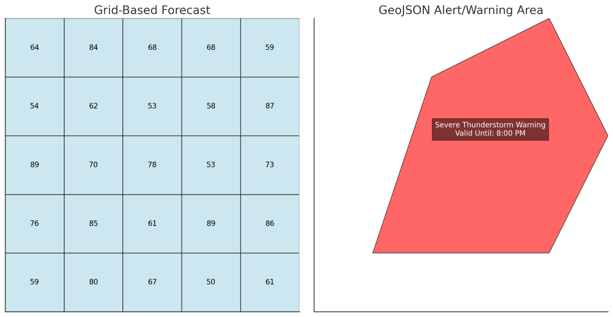

## Alerts and Warnings

The NWS issues alerts when there is a need to
inform the public about significant weather conditions. They're issued
when the weather may pose a serious threat, but
the impact depends on the severity of the forecast. Alerts include
watches, warnings,
advisories, and
statements.

- Warnings are urgent alerts
  that indicate that a serious weather event is imminent or
  happening.

### Forecast Grids vs. Alert Polygons

Understanding the difference between how the NWS API
structures forecast data (via grid points) and alert data (via GeoJSON
polygons) is key to proper visualization and response handling.

The NWS API returns observations and
forecasts within the grid area assigned to a
specific Weather Forecasting Office (WFO) using the
gridX and
gridY parameters. The grid system helps fill in
gaps between data points, providing complete and accurate weather
coverage for an area. For example, let’s say you want to get the
temperature for specific area in Chicago represented by
grid point
(gridX: 45,
gridY: 30).
Since the grid area that we've chosen lies between several observation
stations, the API will estimate the temperature based on multiple
observation stations rather than relying on just one station. This
system allows more precise forecasts, even in areas where weather
stations are far apart. 

When issuing warnings and alerts, the NWS uses precise geographic
boundaries to define the area under threat, rather than relying on
predefined grid cells. A grid-based forecast might say, “Thunderstorms
expected across a 20 × 20-mile area,” even though not all locations
within that area will be equally affected. When a forecasting office
determines that a severe weather event will impact a specific region, it
issues alerts using irregular polygons described
in GeoJSON, which match the actual storm
path. This approach ensures that only the truly
affected areas receive alerts.

## Alerts and Warnings

The NWS issues alerts when there is a need to
inform the public about significant weather conditions. They're issued
when the weather may pose a serious threat, but
the impact depends on the severity of the forecast. Alerts include
watches, warnings,
advisories, and
statements.

- Warnings are urgent alerts
  that indicate that a serious weather event is imminent or
  happening.

### Forecast Grids vs. Alert Polygons

Understanding the difference between how the NWS API
structures forecast data (via grid points) and alert data (via GeoJSON
polygons) is key to proper visualization and response handling.

The NWS API returns observations and
forecasts within the grid area assigned to a
specific Weather Forecasting Office (WFO) using the
gridX and
gridY parameters. The grid system helps fill in
gaps between data points, providing complete and accurate weather
coverage for an area. For example, let’s say you want to get the
temperature for specific area in Chicago represented by
grid point
(gridX: 45,
gridY: 30).
Since the selected grid area lies between several observation
stations, the API will estimate the temperature based on multiple
observation stations rather than relying on just one station. This
system allows more precise forecasts, even in areas where weather
stations are far apart. 

When issuing warnings and alerts, the NWS uses precise geographic
boundaries to define the area under threat, rather than relying on
predefined grid cells. A grid-based forecast might say, “Thunderstorms
expected across a 20 × 20-mile area,” even though not all locations
within that area will be equally affected. When a forecasting office
determines that a severe weather event will impact a specific region, it
issues alerts using irregular polygons described
in GeoJSON, which closely match the actual storm
path. This approach ensures that only the truly
affected areas receive alerts.

## What's GeoJSON?

GeoJSON is an extension of JSON used to encode geographic data
structures. It's the standard format for geographic data in the NWS
API. GeoJSON follows JSON’s syntax but has special
Geometry Objects to represent spatial data.
GeoJSON Geometry Objects include:
Point,
LineString,
Polygon,
MultiPoint,
MultiLineString,
and MultiPolygon. For
an in-depth explanation of GeoJSON, click here \[HREF
explainer\]

